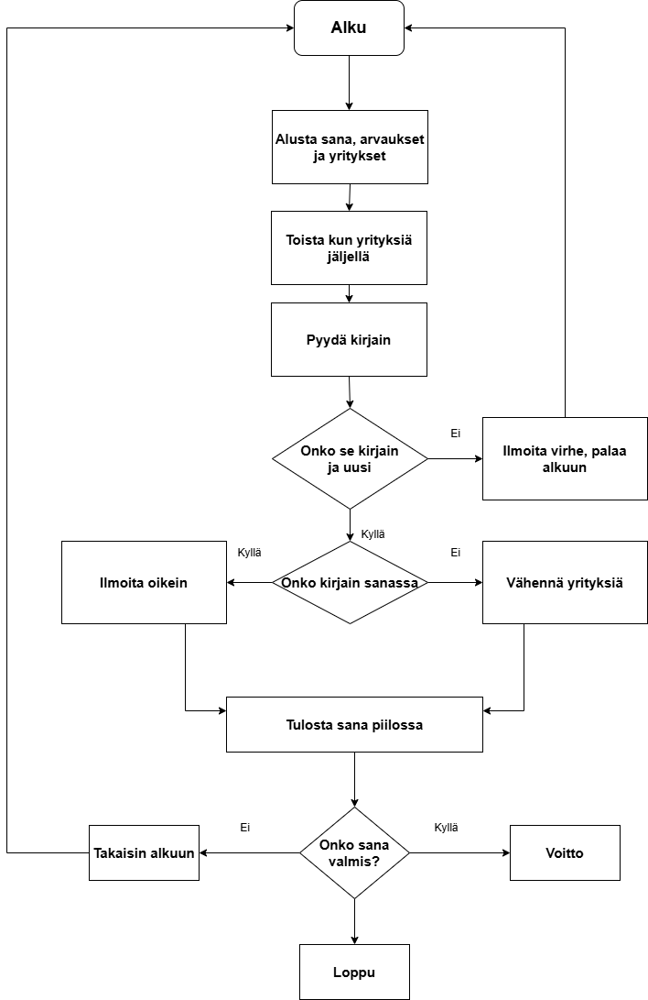

# Hirsisanapuu
Sofia Sallinen ja Erica Levola

## Työmäärän jakautuminen
Erica:Vuokaavio, koodaus, suunnittelu
Sofia: Demovideo, koodaus, suunnnittelu

## Tietoa pelistä
Peli on hirsisanapuu, joka on peli missä pitää arvata oikea kirjain joka kuuluu sanaan. Aina kun arvaat väärin niin yritysten määrä vähenee. Kun arvaat oikean kirjaimen kirjain kirjain/kirjaimet tulevat esiin sanan oikeille paikoille. Kun kaikki kirjaimet on arvattu, oikea sana on valmis ja voitat pelin.

## Suunnittelu
Toteutamme yksinkertaisen hirsisanapuu pelin sanalla "kultainennoutaja".

## Demo-video:
[Linkki videoon](https://youtu.be/5IMQAu8pX-o)
## Vuokaavio:

